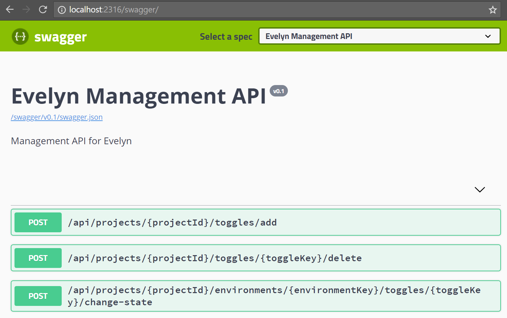

Running the REST Server
=======================

A sample server host is provide for the REST API - this can be found at ``./src/Evelyn.Host``. By default this will run with an in-memory event store. You won't want to run this host in a production environment, but it's useful for now because there are no dependencies to set up and nothing to configure.

You can run the sample host in Visual Studio or on the command line.

Running in Visual Studio
------------------------

Run the ``Samples\Evelyn.Host`` project

Running on the command line
---------------------------

``dotnet .\src\Evelyn.Host\bin\Release\netcoreapp2.0\evelyn.host.dll``

Accessing the REST Server
-------------------------

By default, the sample server host will listen on localhost:2316 - this is configured in ``./src/Evelyn.Host/Properties/launchSettings.json``. 

The Evelyn REST API endpoints are specified using `OpenAPI <https://www.openapis.org/>`_. The sample server host is configured to show us this specification using `Swagger UI <https://swagger.io/tools/swagger-ui/>`_. We can access the Swagger UI in a browser by navigating to ``/swagger/`` endpoint of the server. So, if we're using the default config, this will be at ``http://localhost:2316/swagger/``.

When the server runs for the first time, it will set up a default account for us and add create some sample data to get us started. Lets check it is all set up correctly:

- In Swagger UI, expand the `GET /api/projects` section
- Click the `Try it out` button
- Click the `Execute` button

In Evelyn, a project is a logical collection of feature toggles and environments. The ``/api/projects`` endpoint returns us a list of all the projects on our account. When we click the `Execute` button, Swagger will make a call to this endpoint. The response should look something like this:

.. code-block:: json

   {
      "accountId": "e70fd009-22c4-44e0-ab13-2b6edaf0bbdb",
      "projects": [
         {
            "id": "8f73d020-96c4-407e-8602-74fd4e2ed08b",
            "name": "My First Project"
         }
      ],
      "created": "2018-05-27T15:58:13.6253741+00:00",
      "createdBy": "SystemUser",
      "lastModified": "2018-05-27T15:58:30.7611496+00:00",
      "lastModifiedBy": "SystemUser",
      "version": 1
   }

We can see here that our account ID is ``e70fd009-22c4-44e0-ab13-2b6edaf0bbdb``, and we have a project called ``My First Project`` which has the ID ``8f73d020-96c4-407e-8602-74fd4e2ed08b``.

Now we know the ID of the project, lets now get more details about it:

- Expand the `GET /api/projects/{id}` section
- Click the `Try it out` button
- In the `id` input box, enter the id of the project, ``8f73d020-96c4-407e-8602-74fd4e2ed08b``
- Click the `Execute` button

The response should look something like this:

.. code-block:: json

   {
      "id": "8f73d020-96c4-407e-8602-74fd4e2ed08b",
      "name": "My First Project",
      "environments": [
         {
            "key": "my-first-environment"
         }
      ],
      "toggles": [
         {
            "key": "my-first-toggle",
            "name": "My First Toggle"
         }
      ],
      "created": "2018-05-27T15:58:30.7715006+00:00",
      "createdBy": "SystemUser",
      "lastModified": "2018-05-27T15:58:30.8970043+00:00",
      "lastModifiedBy": "SystemUser",
      "version": 2
   }

We can see that the project has a single environment, ``my-first-environment`` and has one toggle, ``my-first-toggle``.

So far so good. Now lets turn our attention to the client.